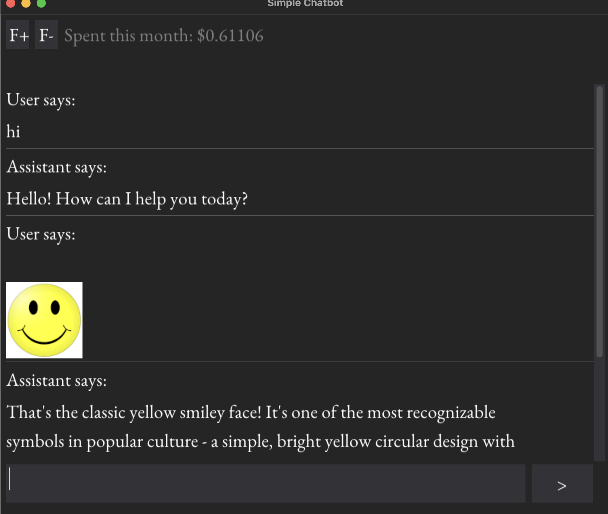

A cross-platform open-source extendable chatGPT-like app with a GUI.



It's using the Antropic's Claude API (but one can easily replace it with another LLM).

# Why?

## Advantages over proprietary apps by Claude, OpenAI, etc
- open-source. You can see exactly what it does and how it works
- no telemetry
- cross-platform. No need to wait for an app for your OS
- modifiable. Add your plugins, change it to your specific use case, replace the AI provider etc.
- you can specify a large custom context that will be applied to all sessions (e.g. the documentation of your project)

## Disadvantages
- the user experience may be not as polished as proprietary apps (we are not a big corp with infinite resources).

# Features

- Functionality:
    - the basic functionality for chatting with AI
    - allows images input
    - allows to copy a message to clipboard
    - shows the API usage costs
    - automatically preserves chat logs in the app's directory, so you can review them later

- GUI:
  - cross-platform (based on dearpygui)
  - mimimalist design
  - multi-line input field (see the hotkeys section below)
  - markdown support (powered by [DearPyGui-Markdown](https://github.com/IvanNazaruk/DearPyGui-Markdown))
  - text wrapping
  - show attached images in the chat
  - click on the image thumbnail to open it in the os default image viewer

- Customization:
  - resizable window
  - customizable font size
  - dark and light themes (change in the config)
  - give the AI your custom permanent context (see the config)
  - you can change many other things in the config
  - the app can be extended with plugins
  - the whole thing is open-source, so modify it in any way you want.

# Installation

1. Clone this repository

2. Navigate to the project directory

3. Set up a virtual environment

   ```bash
   python3 -m venv venv
   source venv/bin/activate  
   ```

4. **Install dependencies**:

   ```bash
   pip install -r requirements.txt
   ```

# Usage

In the terminal, provide the Claude API key:

```bash
export ANTHROPIC_API_KEY="your_anthropic_api_key"
```

Run the main application script:

```bash
python gui_chat.py
```

# Hotkeys

- **New line**: `⌘ + Enter` (macOS)
- **Send message**: `Enter`
